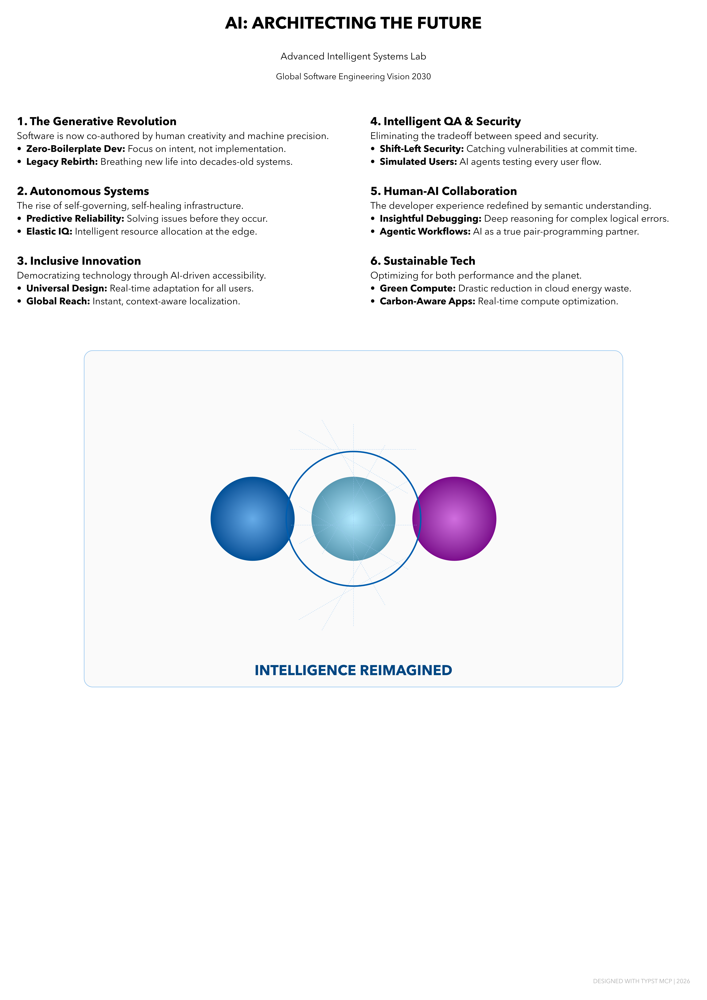

# 📝 Typst MCP Server

A professional Model Context Protocol (MCP) server that brings **Typst's** high-quality document typesetting to your AI workflows.

## ✨ Features

- **Professional Templates**: Create CVs, Papers, Posters, and Reports instantly.
- **High-Quality Rendering**: Compile `.typ` files into PDF, PNG, or SVG.
- **Asset Management**: Automatic organization of generated documents.
- **Remote Ready**: Built-in support for Docker and GitHub Container Registry.

---

## 🎨 Showcase: AI Benefits Poster

The following poster was generated using this server:



---

## 🚀 Quick Start (Docker)

The fastest way to use this server is via Docker. No local installation of Typst is required.

### MCP Configuration

Add this snippet to your `mcp_config.json` (for Claude Desktop or VS Code):

```json
{
  "mcpServers": {
    "typst": {
      "command": "docker",
      "args": [
        "run", "--rm", "-i",
        "ghcr.io/vvijayaragupathy-uno/typst-mcpserver:latest"
      ]
    }
  }
}
```

### Local Build

```bash
docker build -t typst-mcp-server .
docker run -i --rm typst-mcp-server
```

---

## 🛠 Local Setup (Python)

If you prefer to run the server locally:

1. **Install Typst CLI**: [typst.app/docs/cli](https://typst.app/docs/cli/)
2. **Install Dependencies**:
   ```bash
   pip install -r requirements.txt
   ```
3. **Run Server**:
   ```bash
   python3 server.py
   ```

---

⚖️ **License**: MIT
